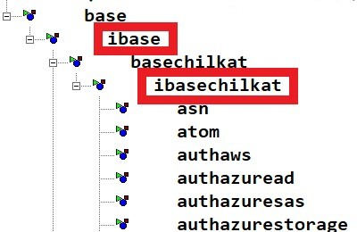
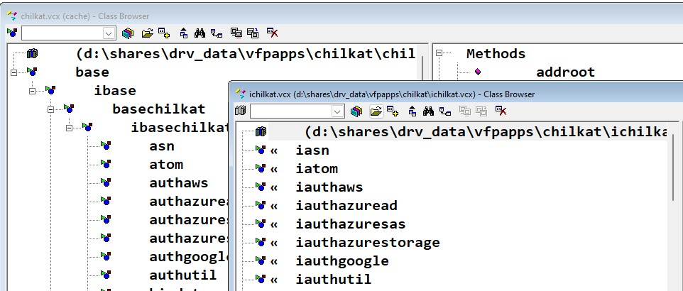

## Using the Chilkat Class Library

I've received some questions about ChilkatVFP along the lines of "What's the best way to do this?". This document will explore some of the ways one can use the ChilkatVFP.VCX and iChilkatVFP.VCX to your advantage.

Let's take a simple scenario. As of ChilkatVFP version 1.33 there's a new property on the BaseChilkat class called cMsgSvcLanguage. It is set to "Original", and the cOriginal field contains English words and phrases. What are the options if you'd like to display French instead of English? In other words, instead of the value being "Original" it should be "French". What's the best way to do this?

Well, there are several ways to accomplish this goal.

First, the value must be set at design time, not run time. That is because the Init method does several checks that if they fail, MsgSvc dialogs are displayed. 

Second, this assumes that your ChilkatVFP download directory is different than the one used in your application. Now if you're just experimenting or just playing around, that's perfectly fine. But you shouldn't update a running business application without testing first.

Okay, let's begin...

1) The easiest way - not necessarily the best way but the easiest way - is to modify the iBaseChilkat.cMsgSvcLanguage property. 

There are empty class layers between the "action" layers - by design. 



The iBase and iBaseChilkat classes are completely empty (excepting an FoxPro.H header reference). These empty classes are used for your bug fixes, enhancements, changes, etc.

And so the easiest way is to change the iBaseChilkat.cMsgSvcLanguage to "French". Voila! This is how the framework is intended to be used.

Downside: If you lay an update on top of ChilkatVFP, that update would stomp on your changes. So you would need to add that change back into ChilkatVFP with every update. 

That's straightforward, not difficult at all, and using the framework as intended. 

2) Make the changes in the iChilkatVFP.VCX library. More work upfront, but less maintenance.



It should be clear that iChilkatVFP.iASN is a subclass of ChilkatVFP.ASN, etc.

At the time of this writing there are ~~105~~ 106 classes within iChilkatVFP.VCX. Do we need to update this property change ~~105~~ 106 times? In theory yes, but there's a workaround...

Change one of the iChilkatVFP cMsgSvcLanguage properties to "French". Save it. Then open the iChilkatVFP.VCX as a table, then issue the following at the command window:

```foxpro
REPLACE ALL Properties WITH [cmsgsvclanguage = French] + ;
CHR(13) + CHR(10) + Properties FOR (NOT EMPTY(CLASS)) 
AND (NOT([cmsgsvclanguage = French] $ Properties))
```

It's messy code but it works. Close the table, recompile iChilkatVFP.VCX.

You could also use the WriteExpression method.

The only maintenance is when there's a new Chilkat class. You will have to manually add the new ChilkatVFP class to your iChilkatVFP.VCX, add the FoxPro.H reference and add your custom code. In theory that would only occur once every few Chilkat releases.

Now if you're just noodling and not supporting a live application with ChilkatVFP, this isn't really necessary. But if ChilkatVFP is included in your business application with both ChilkatVFP.VCX and iChilkatVFP.VCX, this would be my preferred version.

3) Manipulate the MsgSvc table.

This isn't a solution that's framework related, just a solution to this specific issue.

Open the MsgSvc table and issue the following in the command window:

```foxpro
REPLACE cOriginal WITH cFrench FOR RECNO() > 44
```

If you want French and don't care for English, do it this way. The ChilkatVFP custom keys start with record 45 so you're just replacing the custom ones. Now you don't have to even change the cMsgSvcLanguage property.

You'll have to manage each update to see if there are new MsgSvc records, but that should be a rarity.
