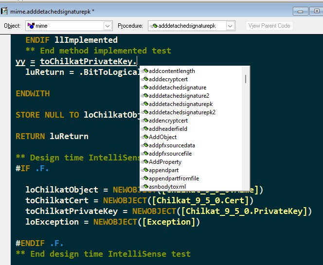

# ChilkatVFP

**A VCX based wrapper class around the Chilkat library (https://www.chilkatsoft.com).**

# VFPX

ChilkatVFP is a Github <a href="https://github.com/VFPX" target="_blank">VFPX</a> project.

# How To Use 

1) Go to (https://www.chilkatsoft.com) and: 
    a) Purchase a license
    b) Download/install a 30 day trial license (use one of the 32-bit ActiveX installers)
    c) Download/install a freeware Chilkat class or two.
2) Add the ChilkatVFP.VCX library to your <b>SET([ClassLib])</b> settings.
3) Ensure FoxPro.H is in your path.
    
You're good to go!

# Questions or Concerns or Kudos

Feel free to contact me at chilkatvfp AT gmail DOT com.

# Motivation

I did some work for an east coast company that used the Chilkat library to accomplish various tasks, mostly email as I remember. I hadn't actually worked with the Chilkat libraries before so I dove in to see what I could find. What I found was...well, daunting. Take a look at the documentation for the Email class - (https://www.chilkatsoft.com/refdoc/xChilkatEmailRef.html) -- I felt as if I was looking up at a skyscraper. The page source alone is over 300K bytes.

But this isn't written just for Visual FoxPro. Their home page mentions 29 languages and 11 operating systems. Do you have a better solution? I don't.

So I understand why it's done this way. It's a double edged sword - Chilkat documents pretty thoroughly but the trouble is Chilkat documents pretty thoroughly and it's a lot to wade through.

But it feels somewhat like dealing directly with the Windows operating system -- you can do anything in Windows, just call the appropriate DLL! Not the most helpful thing around.

So on my own time I began noodling with the idea that became ChilkatVFP. I set it down after a while and the job was eventually Corona'd and that was that.

Recently I started another job based in the east coast that to my surprise used Chilkat a little more heavily. And the need returned.

# Chilkat Primer

The full Chilkat library consists of ~~103~~ 106 classes (~~two~~ three deprecated), containing properties, methods and events. ~~Events are ignored as documentation indicates it is not supported in Visual Foxpro.~~ A property or method can return the following: String, Variant, Long and DateTime (undocumented). Any Chilkat property or method can be read only or read/write. Chilkat properties/methods will return a 0 (false) or 1 (true) to indicate a Boolean value.

# Class Browser Layout

 
 
 * Items of note:
    * The relevant class library matches the name of the Chilkat library. 
    * There's an empty iLayer class between all the "working" classes. You can put your own fixes/enhancements/changes here, as I am deliberately leaving these empty. There is one exception which I will explain below.
        * I had added an iLayer for the instance classes but it made the class library too "muddy" - it was hard to see the forest from the trees, so to speak. Technically it'd be nice to make an iLayer for the instance classes you use (Note: Done!) - make an iCert class as a subclass of Cert, then instantiate iCert and using this newly made class for enhancements and fixes. But it isn't necessary, just recommended.

# ChilkatVFP Primer

* Instance class names match the Chilkat class names (take note of the recommendation above).
* Properties and methods within the class names match the Chilkat class names (with only a couple of exceptions).
* If the referenced Chilkat property/method was introduced in a certain version, ChilkatVFP will test to ensure said property/method is available.
* If the referenced Chilkat class was introduced in a certain version, ChilkatVFP will test to ensure said class is available before instantiating.
* If the referenced Chilkat class was deprecated in a certain version, ChilkatVFP will test to ensure said class is available before instantiating.
* For all the Chilkat methods, the associated ChilkatVFP documentation for that method is included at the top of the related ChilkatVFP method.
* For all the Chilkat properties, the associated ChilkatVFP documentation for that property is contained in the related _Access method.
* As much documentation as could fit into the description was added to all ChilkatVFP properties and methods. You can scroll the VFP property sheet and get a sense of what that method/property does.
* The deprecated class is included (CSP) for completeness - since existing Chilkat applications could still be using it.
* The deprecated/undocumented methods and properties have been included. I have added documentation if I could find some sort of documentation on the method/property. Some of these methods/properties are actually useful to the VFP developer.
* At the time of this writing, the release version of Chilkat is 9.5.0.94 (version 94).
There already some methods and properties in place for the next release version, 9.5.0.95.
* If relevant, properties that only return a certain set of values or a range of values are validated against the documented set/range of values. This is true even if a specific value or keywords were introduced in a specific version. 
* You can return .T./.F. from a method or property to represent a Boolean value with a property setting on the ChilkatVFP instance object [lReturnBitAsLogical].
* ChilkatVFP works with the 3 dot notation [9.5.0.59] and the 2 dot notation [10.1.0]
* Integrated Steven Black's MsgSvc() for message displays (Modified: Now named ChMsgSvc()).
* You can send a .T./.F. to a ChilkatVFP method for a Boolean parameter and it will be automatically converted for you.
* You can send a ChilkatVFP object to a Chilkat method for a Chilkat object parameter and it will automatically be sent for you.
* All ChilkatVFP objects contain a Release() method to destroy objects as necessary.
* Code is written in a somewhat "florid" style - for instance, identifying the type of variable as part of the LOCAL definition. The idea is for the code to be digestible and understandable, not turgid. The "guts" of the framework code does get a little heavy, however. 
* ChilkatVFP PEMs have design time Intellisense, if relevant. See image below. Note that the variable yy was not instantiated, just typed in the method.

  

# Example

Here's a simple example. This assumes the VFP environment is set up correctly...

<pre><code class="language-html">
  LOCAL loChilkatUpload AS [Upload of Chilkat.VCX], ;
  llOKToContinue AS Logical, llSuccess AS Logical, lcMessage AS Character

  STORE .F. TO llOKToContinue, llSuccess

  lcMessage = []
  loChilkatUpload = NEWOBJECT([Upload])

  llOKToContinue = (TYPE([loChilkatUpload.Name]) == T_CHARACTER)

  ** Okay to continue test
  IF llOKToContinue

    WITH loChilkatUpload

      .Hostname = [www.mywebserver.com]
      .Path = [/receiveUpload.aspx]
      .lReturnBitAsLogical = .T.

      ** Add files to be uploaded. 
      .AddFileReference([file1], [dude.gif])
      .AddFileReference([file2], [swordfish.xml])
      .AddFileReference([file3], [sample.doc])

      ** Try the upload. 
      ** The method returns when the upload is completed.
      llSuccess = .BlockingUpload()
      lcMessage = IIF(llSuccess, [Files successfully uploaded!], .LastErrorText)

      MESSAGEBOX(lcMessage, 0)

      .Release()

    ENDWITH

  ELSE

    MESSAGEBOX([Upload object not instantiated!], 0 + 16)

  ENDIF llOKToContinue
  ** End okay to continue test

  RETURN llSuccess

</code></pre>

You're now up and running! Browse the instance class source code to get a feel for what's happening "underneath the sheets". 

For further details please see the Documentation folder.

#### Contact: chilkatVFP at gmail dot com.

